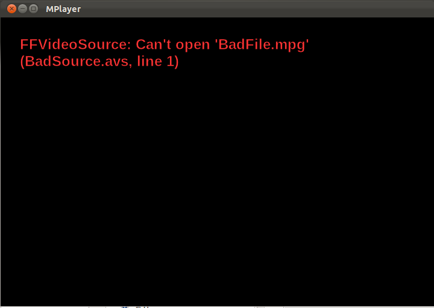

## Introduction 
The AviSynth model for error handling is to generate video with the error message.  For example, the script command:

     src_movie=FFVideoSource(source="BadFile.mpg")

Results in this error video:

While this is useful for interactive usage, it is not a good behavior for an encoding pipeline.  In an automated encoding system, the last thing that you want is a failed encode to produce a video with an error message.  The desired behavior is to raise an error that will cause the encode to fail.

## AvxSynth Error Handling
The default error handling model is identical to AviSynth (generate error video)  However, a new script function has been added: ErrorHandlingExternal.  This function instructs the script engine to log an error and raise an exception when an error occurs.  When the scrip is modified like this: 

     ErrorHandlingExternal
     src_movie=FFVideoSource(source="BadFile.mpg")

Will log this error message:
  
*ERROR   : Module=appInterface,Address=src/avxSynthAppInterface.cpp:666,Type=Error,Message=FFVideoSource: Can't open 'BadFile.mpg' (BadSource.avs, line 2)*

And throw an exception that can be caught by the application.  This results in a much better behavior for automated encoding processes, and failures will terminate the encode, and log an error.