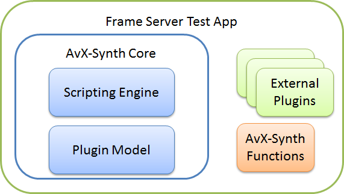

## What is AvxSynth?

AvxSynth is a Linux port of the [AviSynth](http://avisynth.org/mediawiki/Main_Page) toolkit. This port includes the powerful AviSynth scripting engine, as well as many of the built-in functions.

## What's Included?

